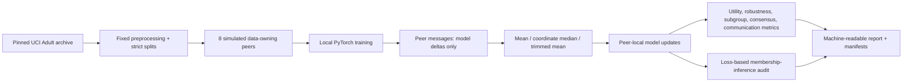

# Decentralized Learning Stress Test

[](https://github.com/Aleck-Tao/decentralized-learning-stress-test/actions/workflows/ci.yml)
[](https://www.python.org/)
[](LICENSE)

A CPU-reproducible PyTorch benchmark for peer-to-peer learning across simulated data owners under non-IID scarcity, local synthetic augmentation, and Byzantine participants.

The experiment asks one bounded question: when peers cannot pool rows, how do local mean, coordinate-median, and trimmed-mean aggregation behave under distribution shift and poisoned contributions, and what loss-based membership signal remains in the trained models?

> **Evidence boundary:** this is a synchronous, single-process message-passing simulation over the public UCI Adult dataset. Client partitions are generated; they are not real organisations. The project does not provide network security, a Byzantine-tolerance theorem, differential privacy, legal compliance, or a public-sector deployment.

## What runs



There is no server node. The main benchmark uses an all-to-all graph so every peer aggregates the same declared sender set locally; a ring topology is implemented for topology and consensus experiments. Messages contain model deltas and minimal metadata, never raw features or labels.

## Controlled scenarios

| Scenario | Data condition | Adversarial condition |
|---|---|---|
| `iid_real` | IID, real rows | none |
| `noniid_scarce_real` | Dirichlet label skew; low-data peers retain a configured fraction | none |
| `noniid_scarce_synthetic` | low-data peers add local non-private bootstrap rows | none |
| `noniid_sign_flip` | same mixed-data condition | a fixed fraction of peers multiply their outgoing update by a negative scale |
| `noniid_synthetic_poison` | malicious low-data peers receive label-flipped local synthetic rows | synthetic-supply poisoning |
| `noniid_synthetic_privacy_audit` | larger local synthetic mix | no Byzantine update; expanded privacy/utility comparison |

The synthetic generator resamples only a peer's local rows and adds bounded jitter to numeric features. It is intentionally simple, explicitly non-DP, and can reproduce characteristics of source rows. It is an experimental treatment, not a privacy mechanism.

## Committed Adult benchmark

The committed full run contains 54 CPU experiments: 6 scenarios × 3 aggregation rules × 3 fixed seeds. Selected means are shown below; the complete table, per-run values, and per-round measurements are in [`results/benchmark`](results/benchmark).

| Scenario | Aggregator | Ensemble balanced accuracy | Worst-peer holdout balanced accuracy | MIA ROC-AUC | Accuracy drop from clean synthetic mix |
|---|---|---:|---:|---:|---:|
| IID real | peer mean | 0.758 | 0.735 | 0.485 | n/a |
| Non-IID scarce real | peer mean | 0.720 | 0.664 | 0.532 | n/a |
| Non-IID scarce + synthetic | peer mean | 0.729 | 0.689 | 0.535 | reference |
| Sign-flip | peer mean | 0.484 | 0.175 | 0.406 | 0.245 |
| Sign-flip | trimmed mean | 0.677 | 0.630 | 0.514 | 0.006 |
| Synthetic-label poisoning | peer mean | 0.707 | 0.652 | 0.529 | 0.022 |

In this configured run, trimmed mean was substantially less affected than peer mean by the sign-flip attack. Synthetic augmentation modestly improved the peer-mean scarcity result but did not improve every aggregation rule. These are observations from one dataset, topology, model family, attack definition, and three seeds—not general robustness claims. Evaluation-only subgroup TPR gaps also remained non-zero, and the reported MIA values must not be interpreted as a privacy guarantee.

The all-to-all runs converge to identical peer states because every peer starts identically and receives the same synchronous sender set. The committed [`ring-smoke`](results/ring-smoke) instead produces non-zero parameter distance and 0.12–0.32 prediction disagreement, demonstrating the separate local-view consensus path on an explicitly synthetic fixture.

## Data and split boundary

The official UCI archive is pinned in [`data/source_lock.json`](data/source_lock.json) by DOI, source URL, CC BY 4.0 licence, archive path, required members, and SHA-256. The loader rejects any other byte sequence.

The original UCI training file forms the only client-partition pool. The official test file is deterministically divided into three disjoint sets:

1. global utility and subgroup evaluation;
2. membership-attack calibration nonmembers;
3. membership-attack evaluation nonmembers.

Each client partition is then split into local train and holdout rows. Source-row IDs are checked across every train, holdout, global-test, attack-calibration, and attack-evaluation boundary. The partition manifest binds both local splits with source-ID hashes and records per-class counts. If a peer holdout contains only one class, the current balanced-accuracy implementation equals that present class's recall rather than a two-class balance; the manifest makes that condition visible. `sex` is excluded from model features and retained only for a two-group TPR-gap diagnostic; that choice does not remove proxy information or establish fairness.

## Reproduce

```bash
python -m venv .venv
# Linux/macOS: source .venv/bin/activate
# Windows: .venv\Scripts\Activate.ps1
python -m pip install -e .

python -m unittest discover -s tests -v
dlstress validate-data --root .
dlstress smoke --root .
dlstress verify --root . --result-dir results/smoke
dlstress benchmark --root .
dlstress verify --root . --result-dir results/benchmark
```

`smoke` uses an explicitly generated fixture and is not an Adult result. `benchmark` requires the pinned `data/raw/adult.zip` and runs 8 peers, 12 rounds, 6 scenarios, 3 aggregators, and 3 fixed experiment seeds on CPU.

PyTorch floating-point results are not claimed to be byte-identical across platforms or library versions. Configurations, source bytes, source data, partitions, synthetic lineage, per-round measurements, reports, and result artifacts are hash-bound; tests use invariants and explicit numerical tolerances.

## Metrics

- ensemble and mean-peer balanced accuracy and ROC-AUC;
- mean and worst-peer holdout balanced accuracy;
- cross-peer prediction disagreement and parameter consensus distance;
- evaluation-only subgroup TPR gap;
- clean-to-attack balanced-accuracy change;
- transmitted tensor payload bytes;
- loss-based membership ROC-AUC, calibrated-threshold advantage, and TPR at 1% FPR.

Membership calibration and evaluation use disjoint member and nonmember samples. This is one black-box attack family. An AUC near 0.5 does not establish privacy, and an AUC below 0.5 is retained rather than relabelled as a success.

## Repository map

```text
src/decentralized_stress/  data, protocol, model, attacks, privacy, evaluation, CLI
configs/                   smoke, test, and full benchmark definitions
data/raw/                  pinned external UCI archive
data/generated/            generated partition and synthetic lineage manifests
results/                   run tables, summaries, reports, and integrity manifests
tests/                     data-boundary, protocol, aggregation, attack, MIA, and end-to-end tests
docs/                      methodology, threat model, provenance, privacy limits, decisions
```

## Explicit non-claims

Version 0.1 does not implement or claim:

- real administrative or confidential data;
- real organisational boundaries or a networked deployment;
- secure aggregation, authentication, encryption, Sybil defence, or network-fault handling;
- a formal Byzantine-fault-tolerance guarantee;
- differential privacy, reconstruction-attack coverage, or comprehensive privacy evaluation;
- LLM inference, semantic quorum, or model-diversity consensus;
- GPU/HPC experience, scalability, or production throughput;
- fairness certification, GDPR compliance, or a lawful data-space implementation;
- affiliation with any external research project;
- state-of-the-art accuracy or external validity beyond this dataset and simulator.

See [`docs/methodology.md`](docs/methodology.md), [`docs/threat_model.md`](docs/threat_model.md), [`docs/privacy_boundary.md`](docs/privacy_boundary.md), and [`docs/data_provenance.md`](docs/data_provenance.md).

## Dataset citation

Becker, B. and Kohavi, R. (1996). *Adult* [Dataset]. UCI Machine Learning Repository. <https://doi.org/10.24432/C5XW20>.

## License

Repository code is MIT licensed. The Adult archive remains under its separately recorded CC BY 4.0 licence and attribution.
